# The Ultimate Avatar Quiz
The Ultimate Avatar Quiz is a multiple choice quiz game for the Avatar The Last Airbender fan to test their skills, and increase their knowledge of Avatar with in a fun and aesthetic way. 

This site is targeted towards people of all ages who love Avatar The Last Airbender and want to test their general knowledge on the series.

Welcome to [The Ultimate Avatar Quiz](https://cpeacocke4.github.io/avatar-quiz/)

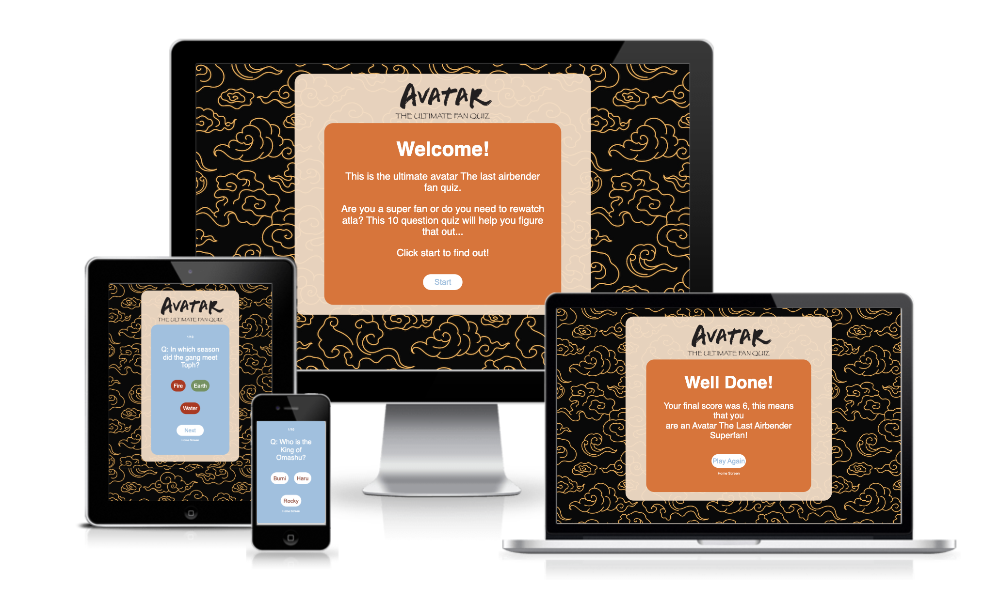

## **Contents** 

* [UX](#ux)
* [Features](#current-features)
* [Future Features](#future-features)
* [Technologies Used](#technologies-used)
* [Testing](#testing)
* [Deployment](#deployment)
* [Credits](#credits)
* [Acknowledgements](#acknowledgements)

## **UX**

### • **Wireframe**
The wireframe for the Avatar Quiz was created using [Adobe Illustrator](https://www.adobe.com/), and shows the basic structures of the quiz on both desktop and mobile.

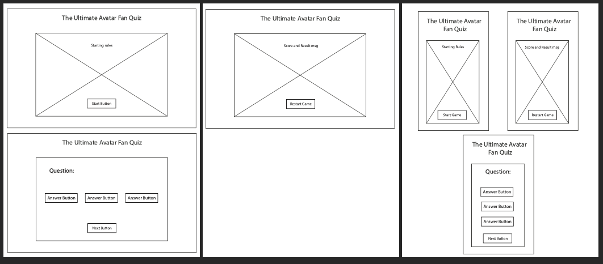

### • **Mock Up**
The mockup for the site was created using [Adobe Illustrator](https://www.adobe.com/) and contains the overall design, image layout and text layout for the site. 

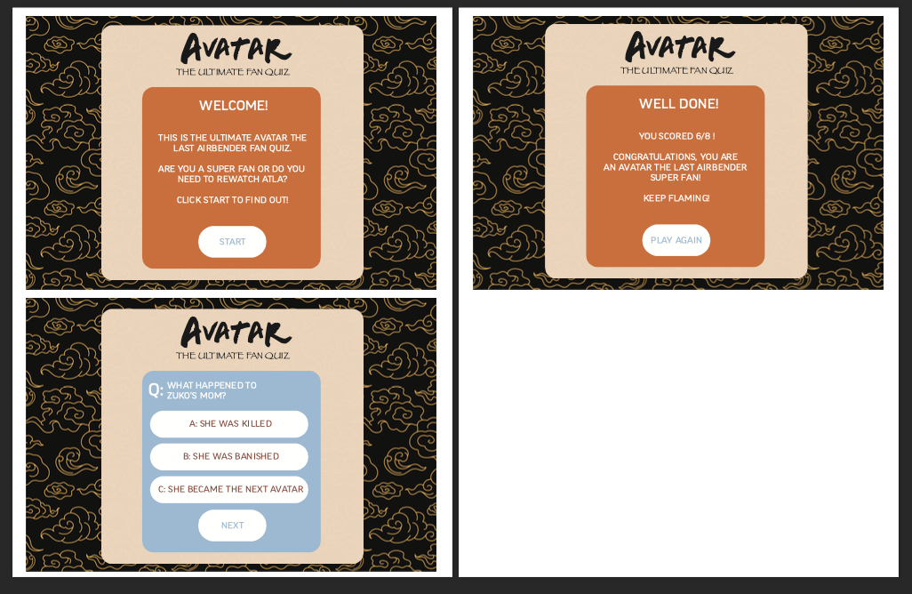

### • **Colour Scheme**
The colour scheme for the site was chosen with the sites purpose and content focus in mind. Colours that resemble the schemes used in the Avatar The Last Airbender series, and are chosen to create a satisfying and clean look.

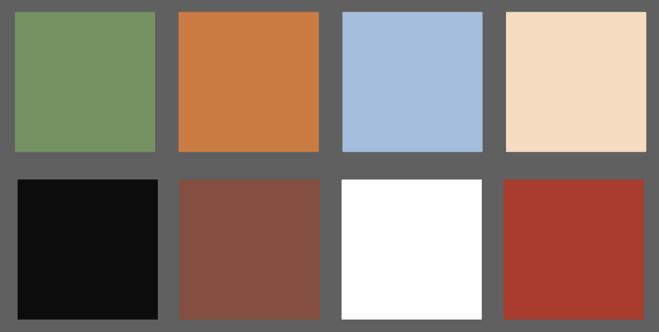

[Back to Top](#the-ultimate-avatar-quiz)

## **Features** 
The Avatar Quiz is designed to be an intuitive experience that allows for a fun and easy game experienc for the user. All of the features implemented were chosen to create a smooth navigation experience through the quiz, and allow the user to focus on the fun and the knowledge! 

### **Logo**

* The logo was custom created in [Adobe Illustrator](https://www.adobe.com/), and was designed to fit within the Avatar The Last Airbender theme, and immediately let the user know of the quiz' content and purpose.

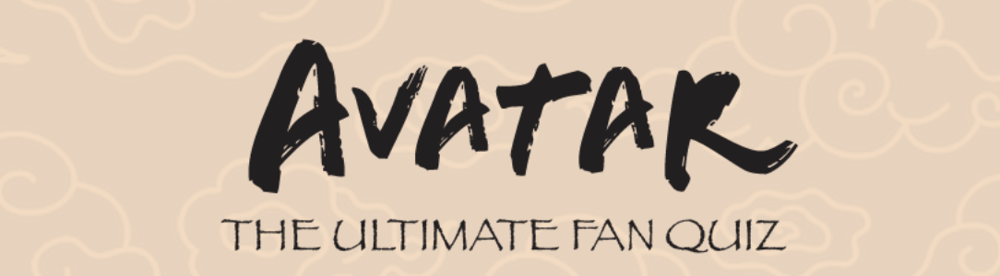 

### • **Welcome Page** 
* The landing page: 
* Welcomes the user to the quiz and explains the parameters and rules of the quiz. 
* Contains a button to start the quiz labeled 'Start' which initiates the quiz.
* Has a readable and contrasting font to the background and clear markings for the user to follow and start the quiz.

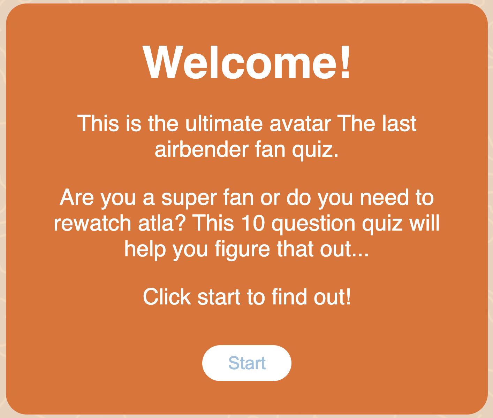

### • **Quiz Page** 
* The quiz page:
* Has a question number tally at the top of the page to show the user how many questions they have answered out of 10.
* Shows a question that is randomised upon every initiation of the quiz.
* Has three clickable buttons containing the answers, which upon being clicked show the correct and incorrect answers in red and green.
* Shows a next button once the user has chosen their answer. 
* Has a homescreen button that takes the user back to the [Welcome Page](#welcome-page).

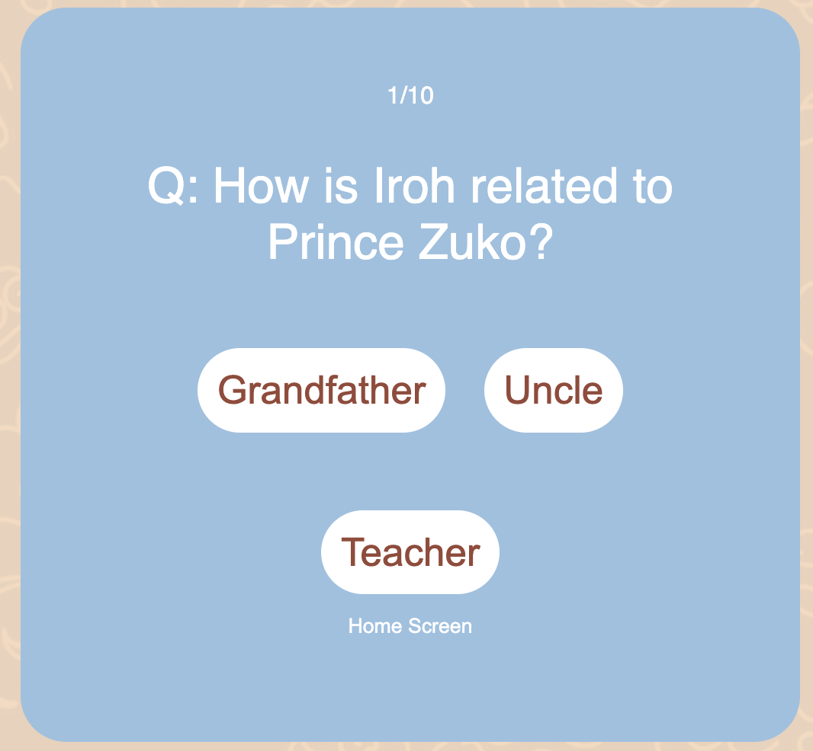

### • **Result Page** 
The result page: 
* Shows the users score, and displays two different messages based on the users score.
* Contains a 'Play Again' button that re-initialises the quiz.
* Has a homescreen button that takes the user back to the [Welcome Page](#welcome-page).

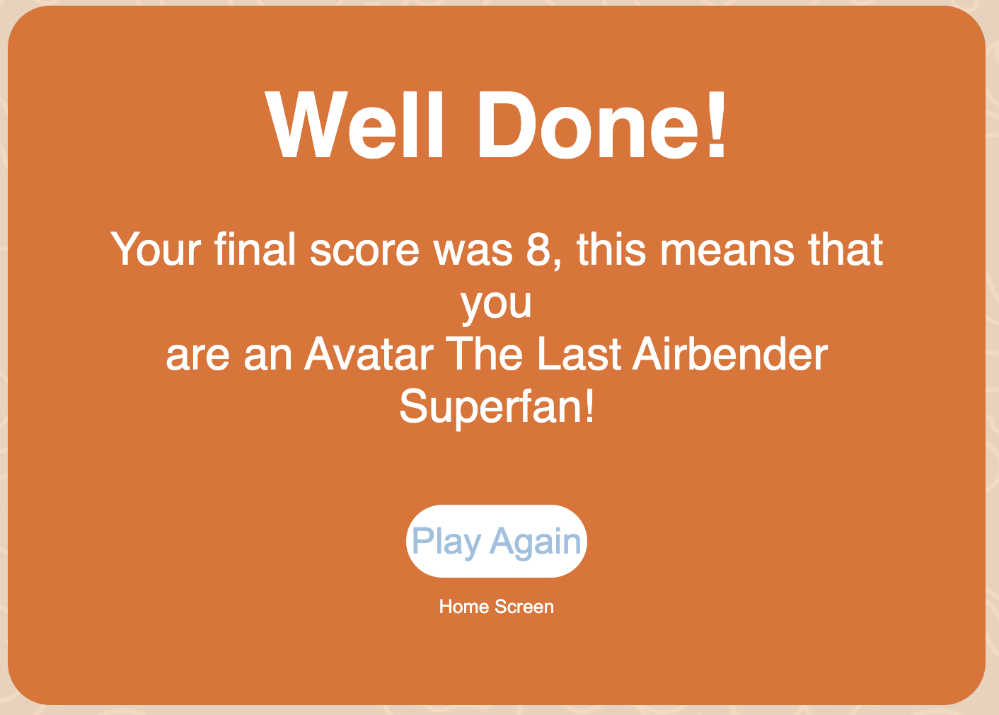

### **Future Features** 

* Different levels of the quiz.
* Multiple quiz topics.
* Background music on page load.
* Sound affects for user interactions.

[Back to Top](#the-ultimate-avatar-quiz)

## **Technologies Used** 

* [HTML5](https://html.spec.whatwg.org/) - For websites structure.
* [CSS](https://www.w3.org/Style/CSS/Overview.en.html) - For the websites styling.
* [Javascript](https://www.javascript.com/) - For the websites functionality.
* [Adobe Illustrator](https://www.adobe.com/) - For the wireframes and mockups.
* [Gitpod](https://www.gitpod.io/#get-started) - Used to host and edit the website
* [Github](https://github.com/) - Used to deploy the website.

[Back to Top](#the-ultimate-avatar-quiz)

## **Testing** 
The site has been extensively tested and found to have minimal to no errors in its structure and styling, and functionality. The game works on multiple browsers and all functions work according to their purpose.

### • **Code Validation**
All code has been tested through the [W3C html validator](https://validator.w3.org/), the [W3C css validator](https://jigsaw.w3.org/css-validator/) and the [JSHint Javascript validator](https://jshint.com/).

* Minor structural errors were found in the html validation and upon fixing no errors were returned. 
* The css validation was returned with no errors.
* Javascript returned minor syntax errors and warnings and upon fixing no errors were returned.

HTML validation result: 
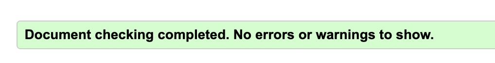

CSS validation result: 
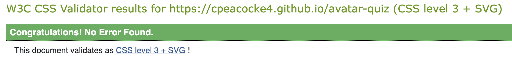

### • **Responsiveness Testing** 
The responsive design tests were carried out manually using [Google Chrome dev tools](https://developer.chrome.com/docs/devtools/), [Responsive Design Checker](https://responsivedesignchecker.com/), as well as manual testing on various devices.

From 320px screen width up to 2000px and above the site website remained cohesive in design and layout: 
* All items flexing correctly and minimal changes to the design. 
* All images rendering correctly.
* All content showing as desired. 

### • **Browser Compatibility** 
The website was tested on Google Chrome, Safari and Mozilla Firefox and resulted in no errors or major changes in structure, styling or preformance. 

### • **Bugs** 
#### **Fixed Bugs** 
During validation a few errors were returned for the index.html file, as listed below:

* Structural error with h3 element used before h1: This bug was fixed simply by changing the h3 elements to h1.
* An empty h1 element: This was simply fixed by adding text to the element.

#### **Unfixed Bugs**
There are no unfixed bugs within the website.

### **Preformance testing** 
The site was finally tested using [Google Lighthouse](https://developer.chrome.com/docs/lighthouse/overview/) which tested for: 
* Performance.
* Accessibility.
* Best Practices.
* SEO.

The results are shown below: 
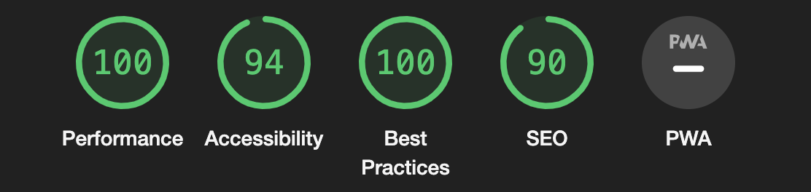

[Back to Top](#the-ultimate-avatar-quiz)

## **Deployment** 
The site was deployed to GitHub pages. 

The steps to deploy are as follows:
* Once you are logged in, go to your GitHub repository and navigate to the **Settings tab**
* Once in the settings tab go to the **Pages** tab in the left hand menu.
* From the source section drop-down menu, select the **Main Branch**.
* Once the main branch has been selected, the page will be automatically refreshed with a detailed ribbon display to indicate the successful deployment.

The live link can be found [here](https://cpeacocke4.github.io/Up-Dog-Studios/index.html)

#### **Fork this repository**
To fork this repository follow the instructions below:

* Log-in to GitHub and locate this repository.
* On the top right of the page is a button called 'Fork', click on the button to create a copy of this repository in your GitHub Account.

#### **Clone this project** 
To make a local clone of this project follow these steps:

* On the repository page, click the **Code** tab.
* In the HTTPS section, click on the clipboard to copy the sites URL.
* In your own personal IDE, open **Git Bash**.
* Type in 'git clone' and paste in the URL copied from this repository.
* Click enter and your clone will be created!

[Back to Top](#the-ultimate-avatar-quiz)

## **Credits**

#### • **Content**

* Fonts came from [Google Fonts](https://fonts.google.com/)
* The function to render the quiz questions was inspire by [This Youtube video](https://www.youtube.com/watch?v=riDzcEQbX6k&ab_channel=WebDevSimplified)
* The code for the event listeners was referenced from [Code Institutes Love Maths project](https://github.com/Code-Institute-Solutions/love-maths-2.0-sourcecode/tree/master/05-tidying-up/01-a-few-last-things)

### • **Media**

* Background Image was sourced from [Freepik.com]( https://www.freepik.com/)
* Quiz questions were sourced from [Funtrivia.com](https://www.funtrivia.com/quizzes/for_children/tv_for_kids_a-c/avatar_the_last_airbender.html)

[Back to Top](#the-ultimate-avatar-quiz)

## **Acknowledgements**
The site was completed as a portfolio project for the Full Stack Software Developer Diploma at [Code Institute](https://codeinstitute.net/se/). 

I would like to thank all those who were involved in supporting me through this project and guiding me along the way:

* My [Code Institute](https://codeinstitute.net/se/) mentor [Precious Ijege](https://www.linkedin.com/in/precious-ijege-908a00168/).
* The [Code Institute](https://codeinstitute.net/se/) Slack community.
* My personal friend and programmer [Michael Robinson](https://www.linkedin.com/in/michael-robinson-48b081224).

Christy Peacocke 2022.

[Back to Top](#the-ultimate-avatar-quiz)